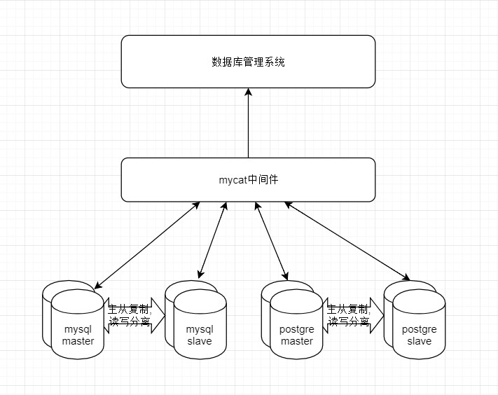

# springboot_desctable
展示数据库的table,table字段类型,table信息,并进行修改
# 数据管理架构图

# Exception的知识点
## try,catch,finally的执行顺序
[try,catch,finally的执行顺序参考博文](http://www.blogjava.net/fancydeepin/archive/2012/07/08/java_try-catch-finally.html)

>(假设方法需要返回值）
java 的异常处理中，  
在不抛出异常的情况下，程序执行完 try 里面的代码块之后，该方法并不会立即结束，而是继续试图去寻找该方法有没有 finally 的代码块，
如果没有 finally 代码块，整个方法在执行完 try 代码块后返回相应的值来结束整个方法；  
如果有 finally 代码块，此时程序执行到 try 代码块里的 return 语句之时并不会立即执行 return，而是先去执行 finally 代码块里的代码，若 finally 代码块里没有 return 或没有能够终止程序的代码，程序将在执行完 finally 代码块代码之后再返回 try 代码块执行 return 语句来结束整个方法；  
若 finally 代码块里有 return 或含有能够终止程序的代码，方法将在执行完 finally 之后被结束，不再跳回 try 代码块执行 return。  
>在抛出异常的情况下，原理也是和上面的一样的，你把上面说到的 try 换成 catch 去理解就 OK 了

## 运行时异常与编译时异常

[运行时异常与编译时异常参考博文](https://blog.csdn.net/wsad578169903/article/details/67645767)

111